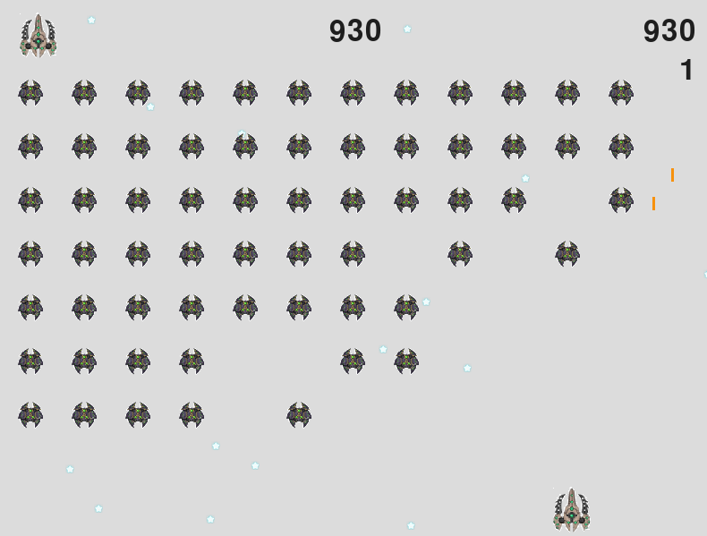

# 👽 Alien Invasion

## Alien invasion is a popular arcade game with same name.
## I created this game by following the book "Python Crash Course, 2nd Edition: A Hands-On, Project-Based Introduction to Programming".

## 🚀 Introduction

#### In Alien Invasion, the player controls a ship that appears at the bottom center of the screen. The player can move
#### the ship right and left using the arrow keys and shoot bullets using the spacebar. When the game begins, a fleet 
#### of aliens fills the sky and moves across and down the screen. The player shoots and destroys the aliens. 
#### If the player shoots all the aliens, a new fleet appears that moves faster than the previous fleet. If any alien 
#### hits the player’s ship or reaches the bottom of the screen, the player loses a ship. 
#### If the player loses three ships, the game ends.

## 🎮 Controls

### Space - shoot
### Arrows keys (left - right) - move the ship left / right
### press 'q' for exit

## Cloning the Repository
### $ git clone https://github.com/tsymbaliuk-ivan/pygame.git
## Running
### $ python alien_invasion.py
### gameplay screen - >

